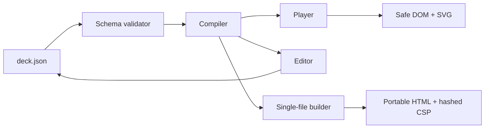
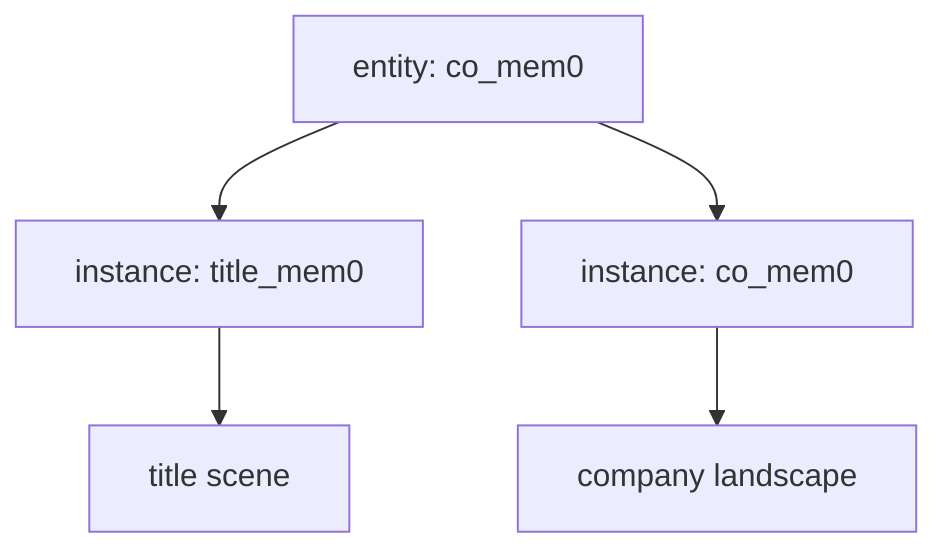

# Architecture

## Boundaries

| Module | Responsibility | Must not do |
|---|---|---|
| `core/schema.js` | Reject malformed, oversized, or dangling graph data | Touch the DOM |
| `core/compile.js` | Clone input, resolve entities, normalize beats and layout | Mutate caller data |
| `core/geometry.js` | Bounds, camera fit, edge endpoints | Depend on browser globals |
| `player/player.js` | Render, navigate, animate, pan, zoom, announce | Interpret arbitrary HTML |
| `player/visuals.js` | Render allow-listed structured mini-visuals | Execute deck-provided code |
| `editor/editor.js` | Reversible visual edits and validated import/export | Bypass validation |
| `cli/` | Validate and summarize deck files | Render |

## Entity and instance separation

An entity is a reusable fact. An instance is a scene-local view of that fact:

This prevents a shared node's physical coordinates from expanding an unrelated scene's camera
bounds. Instance IDs are globally unique; entity IDs may be referenced by many instances.

## Beat semantics

Each beat has three explicit lists:

- `show` — nodes present in the current narrative state;
- `focus` — nodes used for camera fitting and keyboard interaction;
- `revealOrder` — newly added nodes animated in sequence.

There is no implicit “all nodes with step less than N” behavior. A beat is a complete snapshot,
which makes deletions, reorderings, and tests deterministic.
