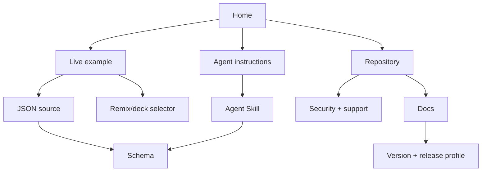

# Public surface contract

Invariant: **no dead-end public surface**.

Every public user or agent entry point must expose or link to:

1. canonical home;
2. source repository;
3. current documentation;
4. schema;
5. version;
6. license;
7. security route;
8. support route;
9. one useful next action.

## Canonical technical-preview copy

- **GitHub About:** Open-source graph-based presentations from versioned JSON. Select and present
  in the browser, validate with the local CLI, and export offline.
- **Visible first sentence:** Prezograph is an open-source graph-based presentation tool for
  creating interactive presentations from versioned JSON—in the browser, with local CLI validation
  and portable single-file export.
- **Agent Skill description:** Creates and edits Prezograph graph-based presentations from source
  material or versioned JSON. Use for graph presentations, shared entities, cross-scene
  connections, reveal order, validation, rendering, offline export, or current CLI guidance.
- **Agent opening:** Turn this into a Prezograph: create a graph-based presentation from source
  material or JSON; validate it, then open it with Prezograph.

YAML, API, and MCP language belongs in a visibly labeled roadmap section until those interfaces
exist.

## Example actions

Every published example exposes:

- **Live** — rendered example;
- **Source** — repository file;
- **Raw** — immutable text form;
- **Remix** — opens the source in the browser player and deck selector;
- **Schema** — exact document contract;
- **Version** — tool and schema version.

## Link graph

