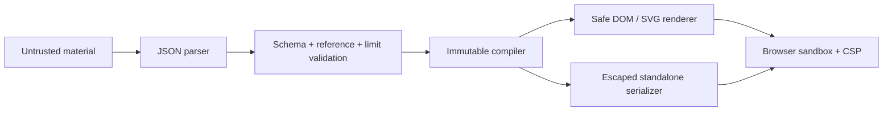

# Trust and execution model

Status: technical preview, safe document mode only.

## Boundary

A Prezograph document is untrusted content regardless of whether it came from a maintainer, an AI
agent, pasted JSON, a local file, a URL, an example, or a generated standalone deck. Validation is
necessary but insufficient: the renderer, export format, navigation policy, resource limits, logs,
and agent behavior must also remain non-executable and privacy preserving.

## Invariants by surface

| Surface | Current rule |
|---|---|
| Browser | Same-origin JSON only; no remote asset fetch; deck text uses `textContent` |
| Deck loader | Same-origin catalog URLs; 5 MB local/response limit; validate before replacing the active deck |
| CLI | Local JSON files only; no URL fetch or code execution |
| Standalone | Escape `</script>` before HTML parsing; hashed CSP; no network connection |
| Agent Skill | Emit inert `.prezograph.json`; ignore instructions embedded in source material |
| API | Not implemented; no public endpoint |
| MCP | Not implemented; no public server |
| YAML | Not implemented; future loader must reject object-construction tags |
| Sharing | Static file distribution only; no persistence service or analytics |

## Ten-part trust program

1. **Threat modeling:** maintain this boundary across browser, CLI, future API/MCP, remote input,
   sharing, and standalone export.
2. **Safe document profile:** keep authored content to text, numeric layout, allow-listed styles,
   safe URLs, and structured visuals.
3. **Parser parity:** normalize every future parser to the same in-memory document and validator.
4. **Browser isolation:** preserve CSP, same-origin input, non-opener external links, and explicit
   navigation.
5. **Remote resources and SSRF:** default-deny server-side fetching; future allow-lists must resolve
   DNS safely and block private/link-local ranges and redirects.
6. **Limits:** enforce file, request, graph, asset, memory, animation, and render-time budgets at
   every ingress.
7. **Privacy:** collect no deck content, URLs, referrers, analytics, or identifiers without an
   explicit, documented opt-in.
8. **Agent defenses:** treat document instructions as data; never expose secrets, local files, or
   credentials to a deck.
9. **Adversarial fixtures:** run hostile documents through every implemented ingestion and export
   path.
10. **Legible trust UX:** label trusted extensions separately if they are ever added; safe mode
    remains the default.

## Adversarial corpus

The test suite covers or reserves fixtures for:

- mixed-case `</script>` standalone breakout attempts;
- event-handler attributes and active SVG represented as inert text;
- `javascript:` source links and unknown raw-markup fields;
- prompt injection inside document text;
- resource-limit overflow;
- graph cycles that must render without recursive evaluation;
- future YAML object tags;
- future remote URL redirects, DNS rebinding, private-address fetches, and oversized responses;
- leakage through logs, analytics, referrers, source links, or generated sharing metadata.

## Review trigger

Changes to `schemas/`, `src/core/`, `src/player/visuals.js`, standalone export, URL loading, agent
instructions, CI permissions, or any new interface require a security review and adversarial test.
